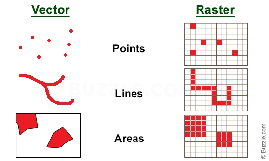

<h1 align="justify"> DATA GEOSPASIAL </h1>
<strong>Latar Belakang Masalah</strong> 
&nbsp;&nbsp;&nbsp;&nbsp;&nbsp;Pada zaman ini segala seuatu menggunakan teknologi dari mulai ojek sampai hal kecil seperti bersih-bersih rumah
memanfaatkan bantuan melalui teknologi digital untuk mencari pelayanan, tidak terkecuali dengan peta. Data geospasial terdapat titik koordinat
yang merupakan gambaran dari peta. Pada peta tersebut terdapat geospasial. Data geospasial mempunyai bagian yang berperan penting yaitu informasi
lokasi, dan informasi atribut-atributnya yang bisa dijelaskan. 
&nbsp;&nbsp;&nbsp;&nbsp;&nbsp;Dari uraian diatas permasalahan-permasalah yang akan dibahas adalah: 
1.Apa yang dimaksud data geospasial? 
2.Apa itu data vektor dan data Raster pada geospasial? 
3.Apa kegunaan dari shapefile dan bagaimana untuk melihat jumlahnya? 

<h3><strong>Pembahasan</strong><h3> 
 
&nbsp;&nbsp;&nbsp;&nbsp;&nbsp;
Data geospasial adalah data yang berhubungan dengan letak atau lokasi geografis,suatu karakter 
benda alam, dan ciptaan manusia yang ada didataran bumi.
 

Ada dua jenis data geospasial yaitu:

1.Kultular = data geospasial yang merupakan buah dari hasil peradaban manusia, data kultural terdapat batas wilayah 

2.Physical = fakta geospasial yang terlihat oleh mata telanjang
 

Pada geospasial ada 2 bagian yang pertama vektor dan yang kedua raster

 Pertama data vektor adalah data yang mempunyai poligon, garis dan juga  titik. Data jenis ini bisa digunakan untuk tujuan
perancangan pembangunan yang digunakan pada peta

yang kedua adalah data raster yaitu data yang di save dengan bentuk kotak segi empat serta untuk nilainya memakai gambar berwarna, sehingga
terbuat ruang yang teratur.

Data vektor bisa didefinisikan sebagai suatu data yang merupakan representasi dari bumi dengan mozaik garis-garis, titik, dan juga polygon.
Pada vektor terdapat class yang bernama shapefile atau disebut juga shp. file shp ini digunakan untuk men save data-data geografis vektor. Sebenarnya shapefile 
ini adalah sekumpulan file-file yang berbeda. kegunaan shapefile ini yaitu untuk menyimpan data geografis, dan jumlah kota pada batas lingkup yang sudah ditentukan dengan
bantuan dari sistem. 

Dalam tutorial yang saya paparkan dalam  video saya menggunakan qGis dan juga Python. Pada file shapefile(shp) terdapat banyak method,
misalnya method shape dan reader. Kegunaan dari method reader yaitu untuk membaca data pada shp file, Sedangkan metod yang satu lagi (shapes) gunanya untuk pembacaan
shapes pada file shp.

<h3 align="justify">Penutup</h3>

Kesimpulan

Untuk dapat melihat data spasial dapat menggunakan qGis dapat juga menggunakan Python

Saran

perbanyak membaca bahasa pemogramman Python agar bisa menguasai data geospasial menggunakan Python
