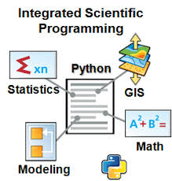

<strong>LATAR BELAKANG MASALAH</strong> 
     
 banyak aplikasi yang membutuhkan data-data geospasial, contohnya seperti google earth, maka dibuatlah blog ini untuk meretrive data geospasial yang berupa data vektor.

Geometri suatu data pada titik koordinat yang bisa berwujud bangun 2 dimensi / 3 dimensi diantaranya: 
a. Polygon 
b. Garis Shape, type / Line (bukan sosmed ya :v) 
c. titik/ Point (tanpa Blank) 

Geometri menurut standar ESRI dibagi menjadi 3 bagian: 
1. point  
2. polyline  
3. Poligon 

operasi pada pemogramman Python  
Library pyshp adalah import shapefile penjelasan instansi (OOP maksudnya) kelas  shapefile pada suatu variabel  

Sf = shapefile.Reader(‘Bts.shp’)  
Penjelasan : 
SF = Variable 
Shapfile = Sebuah class 
Reader = Method 
Bts,shp = Parameter file 
Method method pada data DBF dan SHP 
Method pada data DBF 
sf.fileds() adalah untuk melihat attribute table 
sf.records() adalah untuk mengambil semua record 
sf.record(n) adalah untuk isi record 
Method pada data SHP 
Sf.shapes() adalah untuk mengambil semua record geometri 
Sf.shape(n) adalah untuk mengambil 1 record pada baris n Cara untuk mengambil 1 record dengan parameter nilai atau Array 
sf.records(0) [8] 
sf.field(0) [8] 
Titik koordinat terdapat 4 titik 
BBOX 
POINT 
SHAPETYPE 
Contoh Code untuk menampilkan nama Negara memakai contruk . 
For a in sf.records(): 
If a[8] = “Indonesia” 
Print a 
Atau bisa juga 
I = 0 
For a in sf.records(): 
If a[8] ==”Zimbabwe”: 
Print a : 
I = i+1 
menampilkan jumlah record melalui terminal cmd 

  
masukan koding Indicator.py   
  
membuat method select,  Where Negara Indonesia Output Data Record Negara Indonesia  
   

<strong>kesimpulan</strong> 

Dengan membuat class di python yang sesuai dengan file.py akan membuat kita bisa melihat record data. Dengan perintah perintah yang sudah dipraktekan kita menjadi lebih tahu hal hal yang baru di Python. 
 
<strong>saran<strong>  

Pengembangan GIS untuk User dan bagaimana penerapannya dgn bahasa python harus dipraktekan. 
 
nama : gentur ariyadi siddiq permana yakti  
npm : 1144025 
kelas : 3b 
prodi : D4 teknik informatika 
matakuliah: sistem informasi geografis 
