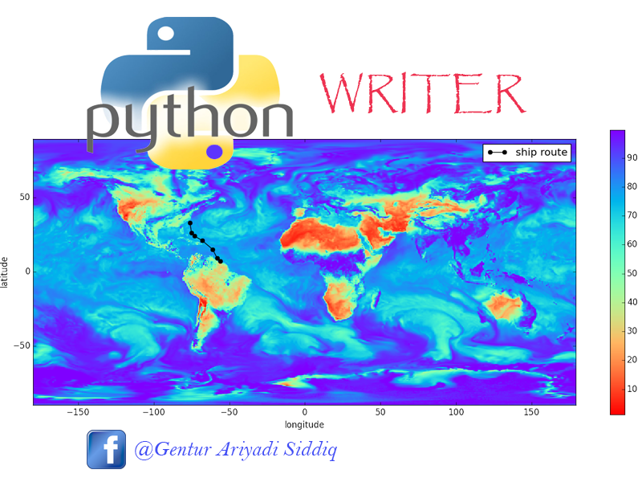

<h1 align="justify">MEMEBUAT DATA GEOSPASIAL</h1>

 kode yang digunakan untuk membuat data geospasial dengan bahasa python yaitu:
  
import shapefile  
a = shapefile.Writer()  
 

 file untuk membuat data geospasial ada 2 yaitu: 
 
1. shp  
contohnya: 
a.point(x,y) 
a.poly([x,y],[v,w]) 
2. dbf  
contohnya:  
a.field('namafield','C','40') 
a.record('Bdg) 

 file itu disimpan dengan method:
 
a.save('file.shp') 
 

<h2 align="justify"><strong>Penjelasan method-method pada Writer</strong></h2>
<h4 align="justify"><strong>Point(x,y)</strong>

menginputkan data berbentuk point/titik ke dalam file shp dan harus sesuai dengan format yang ditentukan ESRI 

<h4 align="justify"><strong>Poly([a,b],[c,d])</strong></h4>

 menginputkan data geospasial yang berupa polygon(kembali ke titik awal), dan polyline(tidak kembali ke titik awal)

<h4 align="justify"><strong>field('kota','C','40')</strong></h4>

membuat atribut tabel bernama 'kota' dengan tipe varchar, dengan panjang 40 karakter, jika ingin menmbahkan
 field maka panggil kembali method field contoh: field('Budaya','C','40')

 <h4 align="justify"><strong>Record(''Bandung')</strong></h4>
 
mengisi tabel yang hanya terdapat 1 field dengan value = 'Bandung', jika ada 2 field maka record('Bandung','Kota')

 <h4 align="justify"><strong>save('namafile')</strong></h4>
 
digunakan menyimpan file berbentuk shapefile dikomputer

 <h4 align="justify"><strong>Param Writer</strong></h4>
 
 shapefile     POLYGON

 
 shapefile     POINT

 
 shapefile     POLYLINE

 
contoh: 

 
<strong>POINT</strong>

 a.point(10,12)  
 
<strong>POLYLINE</strong>

 a.poly(parts=[[[1,5],[5,5],[3,3]]],  
 shapetype = shapefile.POLYLINE) 
 
<strong>POLYGON</strong>

 a.poly(parts=[[[1,5],[5,5],[5,1]]])
 
 
 

 
 
 

